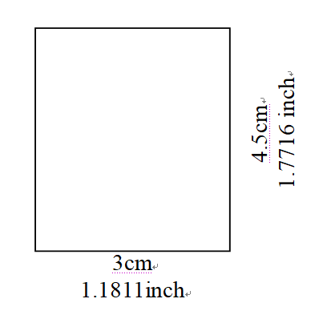

## [晶片護照相片規格](https://www.boca.gov.tw/cp-16-4123-c2932-1.html)
- 發布日期：107-01-05
- 直4.5公分且橫3.5公分(不含邊框)
  
  
## 範例1：
> 寬x長 = 2001(px) x 2572(px)  
> 為了使其符合為 3cm x 4.5cm  
> 解析度要調整為(2572px)/((4.5cm)/(2.54cm/inch)) = 1451px/inch
