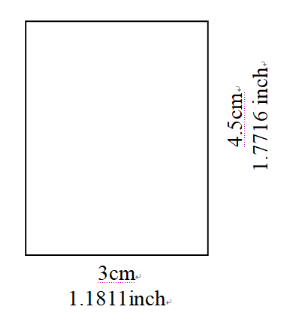

###### #旅行、#旅遊、#出遊、#出國、#搭飛機、#國際航線、#郵輪、#辦護照、#大頭照、#大頭貼、#修圖、#調整

## [晶片護照相片規格](https://www.boca.gov.tw/cp-16-4123-c2932-1.html)
- 發布日期：107-01-05
- 直4.5公分且橫3.5公分(不含邊框)  
  
- 人像自頭頂至下顎之長度介於3.2公分至3.6公分（亦即臉部佔據整張相片面積的70~80%）
  - 3.2: `3.2/4.5 = 0.71%`
  - 3.6: `3.6/4.5 = 0.80%`
  
## 範例1：
> 寬x長 = 2001(px) x 2572(px)  
> 為了使其符合為 3cm x 4.5cm  
> 解析度要調整為(2572px)/((4.5cm)/(2.54cm/inch)) = 1451px/inch

## 範例2：
> 寬x長 = 1831(px) x 2355(px)  
> 為了使其符合為 3cm x 4.5cm  
> 解析度要調整為(2355px)/((4.5cm)/(2.54cm/inch)) = 1329px/inch  
>   
> 
> 人像自頭頂至下顎之長度介於  
> = 2355x0.71 ~  2355x0.8  
> = 1672px ~ 1884px  
> 中間值為 1778px  
